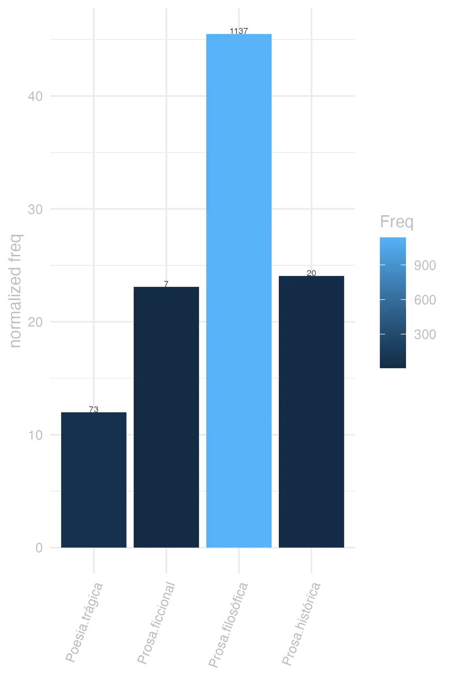

```{r  setUp, include=FALSE}
 library(tidyverse) 

      EntryData <- readRDS(paste0("./", dir("./")[str_detect(dir("./"), "_xx104-97-98-101-111xx_.*?.rds")]))

```


#### Exemplos

non sunt otiosi quorum uoluptates multum negotii <b>habent</b> <small><small>&ensp; -- </small></small><br>
<small><i> -- </i><small>&ensp; -- </small></small><br><br>  illa falsa multum <b>habent</b> uani <small><small>&ensp; -- </small></small><br>
<small><i> -- </i><small>&ensp; -- </small></small><br><br>  non exiguum temporis <b>habemus</b> set multum perdimus <small><small>&ensp; -- </small></small><br>
<small><i> -- </i><small>&ensp; -- </small></small><br><br>  praeterea inquit conceditis diuitias <b>habere</b> aliquid usus <small><small>&ensp; -- </small></small><br>
<small><i> -- </i><small>&ensp; -- </small></small><br><br>  non tantum <b>habere</b> tibi liceat sed calcare diuitias <small><small>&ensp; Sen.Ep.16.8 </small></small><br>
<small><i> que te seja permitido não só ter as riquezas, mas pisar nelas; </i><small>&ensp; JDD </small></small><br><br>  et cui deesse hoc potest ullam modo uirtutem <b>habenti</b> <small><small>&ensp; -- </small></small><br>
<small><i> -- </i><small>&ensp; -- </small></small><br><br>  nam magnitudo non <b>habet</b> modum certum conparatio illam aut tollit aut deprimit <small><small>&ensp; -- </small></small><br>
<small><i> -- </i><small>&ensp; -- </small></small><br><br> 


#### barchart




